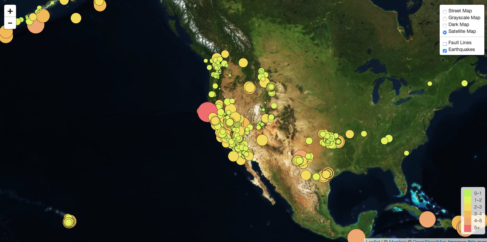

# Visualising Data with Leaflet

## Introduction
This challenge is building a map to visualise the USGS earthquake data.

## Data
* [USGS GeoJSON Feed](http://earthquake.usgs.gov/earthquakes/feed/v1.0/geojson.php)
* [Data on tectonic plates](https://github.com/fraxen/tectonicplates)

## Import & Visualisation
* Create a map using Leaflet that plots all of the earthquakes from `all_week` data set based on their longitude and latitude.
  * Reflect the magnitude of the earthquake in their size and color
  * Include popups that provide additional information about the earthquake when a marker is clicked
  * Create a legend that will provide context for the map data
  
  

* Also, illustrate the relationship between tectonic plates and seismic activity on your the map.
* Allow users to choose from a number of base maps, and have the two different data sets in separate overlays that can be turned on and off independently.

## Copyright

Trilogy Education Services © 2021. All Rights Reserved.
